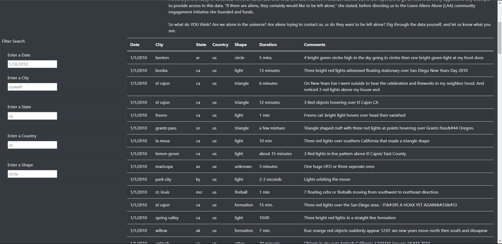
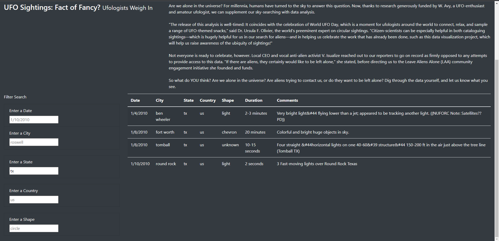

# UFO Sightings: Fact or Fancy?

## Purpose of Analysis
The purpose of this analysis was to use a combination of Javascript ES6, HTML, CSS, and Bootstrap to assist Dana, a data journalist, with creating an interactive webpage used for searching documented UFO sightings throughout the United States.

## Results
The result of this analysis was an interactive webpage with the ability to filter through data for specific instances of UFO sightings. The webpage allows for data to be filtered through date, city, state, country, or shape of the UFO.

## Summary
In summary, the analysis was a success in terms of what the intention of this project was. Here are a few ideas for addittions I would make for the webpage:

1.) I would use web scraping so that our data isn't limited to our data.js file. This would give access to a ton more instances of UFO sightings and would create a one-stop-shop for access to most, if not all, sightings across the United States.

2.) I would add the ability for users to enter their own experiences with UFO sightings. But before the user is allowed to enter their own experience, I would collect data from them such as email, name, phone number, etc. so that you're able to contact them for follow-up and to send updates whenever you make adjustments to the webpage.